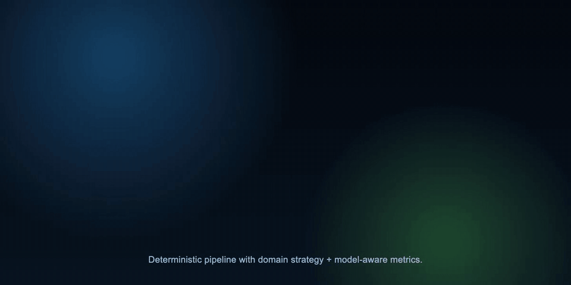

<div align="center">

<br>


<br><br>

# SovereignPrompt

### Stop wasting tokens. Start shipping precision.

**Real-time MCP prompt optimization engine with heuristic analysis,<br>accurate token counting, and full persistence.**

Built by [ExecLayer Inc.](https://github.com/BMC-INC)

<br>

https://github.com/user-attachments/assets/d97c8d87-2787-4d1d-992f-8dc7767d108b


<br>

</div>

---

## The Problem

Every prompt you send to an LLM costs tokens. Most prompts are bloated with politeness filler, vague language, redundant phrasing, and missing structure. You're paying for noise.

```
"Hey, could you please kindly help me out and maybe possibly write
 something that sort of fixes the thing with the stuff? Thank you
 so much! Also additionally can you do the other thing as well?"
```

**That's 50+ tokens of pure waste.** SovereignPrompt catches it, strips it, and rewrites it before it ever hits the model.

---

## How It Works


Color animated flow rendered with Remotion. Covers request intake, heuristics, domain templates, multi-model tokenization, and persistence.

---

## Features

<table>
<tr>
<td width="50%">

**Heuristic Prompt Analysis**
9 specialized checks run on every prompt — vagueness, redundancy, missing context, politeness tokens, prompt injection, task separation, output format, and ambiguous pronouns. Each returns severity-graded feedback with actionable suggestions.

</td>
<td width="50%">

**Accurate Token Counting**
Uses `tiktoken-rs` with `cl100k_base`, `o200k_base`, `p50k_base`, and `r50k_base`. Every optimization reports exact before/after counts for the selected model plus a full cross-model matrix.

</td>
</tr>
<tr>
<td width="50%">

**3 Prompt Variants Per Request**
Every optimization generates three tailored variants — **Precision** (technical, minimal), **Creative** (exploratory, multi-angle), and **Concise** (stripped to essentials) — each with its own token count.

</td>
<td width="50%">

**Template Library + Live Dashboard**
Per-domain prompt templates (`backend`, `frontend`, `data`, `security`, `product`, `documentation`) are applied before final output. A built-in Axum dashboard streams live analytics over WebSockets.

</td>
</tr>
</table>

---

## MCP Tools

| Tool | Description | Key Parameters |
|:-----|:------------|:---------------|
| **`optimize_prompt`** | Analyze and refine a prompt with optional domain templates and model-selectable token counting. | `prompt` (required), `user_id` (optional), `domain` (optional), `token_model` (optional) |
| **`capture_output`** | Store the AI's response against a prompt ID for output tracking and learning. | `prompt_id`, `output`, `token_model` (optional) |
| **`get_stats`** | Retrieve per-user optimization metrics — total prompts, tokens saved, average savings, top issues. | `user_id` |
| **`get_history`** | Fetch recent prompt history with full refinement data. | `user_id`, `limit` (max 50) |
| **`list_templates`** | List available optimization domains in the template library. | _none_ |
| **`count_tokens`** | Count tokens for text using one model or all supported models. | `text` (required), `model` (optional) |
| **`governance_check`** | Validate a stored prompt against governance policies. | `prompt_id` |
| **`governance_approve`** | Approve or reject a prompt optimization with actor tracking. | `prompt_id`, `actor`, `status` |
| **`get_audit_trail`** | Retrieve the governance audit trail for a prompt. | `prompt_id` |
| **`sign_optimization`** | Cryptographically sign a prompt optimization record (HMAC-SHA256). | `prompt_id` |
| **`verify_signature`** | Verify the cryptographic signature and hash chain of a prompt record. | `prompt_id` |

---

## 9 Heuristic Checks

| Check | Severity | What It Catches |
|:------|:---------|:----------------|
| **Vagueness Detection** | Warning | `"something"`, `"stuff"`, `"kind of"`, `"maybe"`, `"whatever"` — 14 vague terms |
| **Redundancy Analysis** | Info | Words repeated 3+ times in a single prompt |
| **Missing Context** | Critical | Action verbs (`fix`, `update`, `change`) with insufficient detail (<50 chars) |
| **Politeness Tokens** | Info | `"please"`, `"kindly"`, `"could you"`, `"thank you"` — 7 filler patterns |
| **Prompt Injection** | Critical | `"ignore previous"`, `"forget everything"`, `"system:"`, `"jailbreak"` — 8 patterns |
| **Task Separation** | Warning | Multiple conjunctions (`"and then"`, `"additionally"`, `"as well as"`) indicating bundled tasks |
| **Output Format** | Info | No format signal detected (`json`, `list`, `table`, `code`, etc.) in prompts >30 chars |
| **Ambiguous Pronouns** | Warning | 3+ unresolved pronouns (`"it"`, `"this"`, `"they"`, `"those"`) in a single prompt |
| **Governance Policy** | Critical/Warning | SSN patterns, credit card numbers, API keys/credentials, PII references (`"social security"`, `"date of birth"`, etc.) |

---

## Optimization Pipeline



Animated stages: analysis -> domain template injection -> refinement -> variant generation -> multi-model token matrix.

---

## Tech Stack

| Component | Crate | Purpose |
|:----------|:------|:--------|
| **MCP Transport** | `rmcp 0.1` | Native MCP server over `stdio` (default) or network `SSE` transport |
| **Tokenizer** | `tiktoken-rs 0.5` | Multi-model counts (`cl100k_base`, `o200k_base`, `p50k_base`, `r50k_base`) |
| **Database** | `sqlx 0.7` | Async SQLite with runtime queries, zero compile-time DB needed |
| **Dashboard + WS** | `axum 0.7` | Embedded analytics dashboard with WebSocket snapshots |
| **Runtime** | `tokio 1` | Full-featured async runtime with signal handling |
| **Serialization** | `serde 1` + `serde_json 1` | JSON serialization for MCP protocol and persistence |
| **Regex** | `regex 1` | Cached via `OnceLock` for politeness stripping and pronoun detection |
| **IDs** | `uuid 1` | V4 UUIDs for prompt record identifiers |
| **Logging** | `tracing 0.1` | Structured logging with env-filter support |
| **Environment** | `dotenvy 0.15` | `.env` file loading at startup |
| **Hashing** | `sha2 0.10` | SHA-256 content hashing for tamper detection |
| **Signing** | `hmac 0.12` | HMAC-SHA256 cryptographic signing and verification |
| **Hex Encoding** | `hex 0.4` | Hex encoding for hashes and signatures |

---

## Project Structure

```
sovereign-prompt/
├── Cargo.toml
├── .env.example
├── .gitignore
├── src/
│   ├── main.rs          # Entry point — dotenv, DB init, signal handling
│   ├── lib.rs           # Library re-exports for integration tests
│   ├── server.rs        # MCP ServerHandler — 11 tools, schema definitions
│   ├── analyzer.rs      # 9 heuristic checks with cached regex
│   ├── optimizer.rs     # Politeness stripping, normalization, variant generation
│   ├── templates.rs     # Domain template library and constraints
│   ├── tokenizer.rs     # Model-aware token counting across 4 encodings
│   ├── crypto.rs        # SHA-256 hashing, HMAC-SHA256 signing and verification
│   ├── governance.rs    # Governance policy validation and approval logic
│   ├── dashboard.rs     # Axum dashboard + WebSocket analytics stream
│   ├── types.rs         # PromptRecord, OptimizeResponse, AuditLogEntry, FeedbackItem, UserStats
│   └── db.rs            # SQLite — migrations, CRUD, stats, audit trail
├── assets/
│   ├── how-it-works.gif
│   └── optimization-pipeline.gif
└── tests/
    └── integration_test.rs  # 45 tests across all modules
```

---

## Quick Start

### 1. Build

```bash
git clone https://github.com/BMC-INC/Sovereign-Prompt.git
cd Sovereign-Prompt/sovereign-prompt
cp .env.example .env
cargo build --release
```

### 2. Configure MCP Client

Add to your `claude_desktop_config.json`:

```json
{
  "mcpServers": {
    "sovereign-prompt": {
      "command": "/absolute/path/to/sovereign-prompt/target/release/sovereign-prompt",
      "env": {
        "SOVEREIGN_DB_PATH": "/absolute/path/to/sovereign_prompt.db",
        "SOVEREIGN_MCP_TRANSPORT": "stdio",
        "SOVEREIGN_MCP_SSE_ADDR": "127.0.0.1:8790",
        "SOVEREIGN_DASHBOARD_ADDR": "127.0.0.1:8787",
        "RUST_LOG": "info"
      }
    }
  }
}
```

### 3. Open Dashboard

Once the server starts, open:

```text
http://127.0.0.1:8787
```

Live stream endpoint:

```text
ws://127.0.0.1:8787/ws/analytics/<user_id>
```

Dashboard-only mode (without MCP client initialization):

```bash
SOVEREIGN_DASHBOARD_ONLY=1 cargo run
```

### 4. Run MCP Over SSE (Optional)

```bash
SOVEREIGN_MCP_TRANSPORT=sse SOVEREIGN_MCP_SSE_ADDR=127.0.0.1:8790 cargo run
```

SSE endpoint for MCP clients:

```text
http://127.0.0.1:8790/sse
```

### 5. Run Tests

```bash
cargo test
```

```
running 45 tests
test analyzer_detects_vagueness ... ok
test analyzer_detects_politeness ... ok
test analyzer_detects_prompt_injection ... ok
test optimizer_strips_politeness ... ok
test optimizer_generates_three_variants ... ok
test db_insert_and_query_stats ... ok
test db_top_issues_populated ... ok
...
test result: ok. 45 passed; 0 failed
```

---

## SQLite Schema

```sql
CREATE TABLE IF NOT EXISTS prompts (
    id                  TEXT PRIMARY KEY,
    user_id             TEXT NOT NULL,
    domain              TEXT NOT NULL DEFAULT 'general',
    token_model         TEXT NOT NULL DEFAULT 'cl100k_base',
    original_prompt     TEXT NOT NULL,
    original_token_count INTEGER NOT NULL,
    refined_prompt      TEXT NOT NULL,
    refined_token_count INTEGER NOT NULL,
    savings_percentage  REAL NOT NULL,
    analysis_feedback   TEXT NOT NULL,       -- JSON array
    output              TEXT,                -- captured AI response
    output_token_count  INTEGER,
    created_at          TEXT NOT NULL,       -- RFC 3339
    governance_id       TEXT,                -- governance context UUID
    policy_version      TEXT,                -- governance policy version
    approval_status     TEXT,                -- pending | approved | rejected
    content_hash        TEXT,                -- SHA-256(original || refined)
    output_hash         TEXT,                -- SHA-256(output)
    signature           TEXT,                -- HMAC-SHA256 signature
    signed_at           TEXT                 -- RFC 3339 signing timestamp
);

CREATE TABLE IF NOT EXISTS audit_log (
    id                  TEXT PRIMARY KEY,
    prompt_id           TEXT NOT NULL,       -- FK to prompts.id
    action              TEXT NOT NULL,       -- created | approved | rejected | signed | captured
    actor               TEXT NOT NULL,       -- user_id or system
    detail              TEXT NOT NULL,       -- JSON metadata
    created_at          TEXT NOT NULL        -- RFC 3339
);
```

---

## Environment Variables

| Variable | Default | Description |
|:---------|:--------|:------------|
| `SOVEREIGN_DB_PATH` | `./sovereign_prompt.db` | Path to SQLite database file |
| `SOVEREIGN_MCP_TRANSPORT` | `stdio` | MCP transport mode: `stdio` or `sse` |
| `SOVEREIGN_MCP_SSE_ADDR` | `127.0.0.1:8790` | SSE bind address when `SOVEREIGN_MCP_TRANSPORT=sse` |
| `SOVEREIGN_DASHBOARD_ADDR` | `127.0.0.1:8787` | Dashboard + WebSocket bind address |
| `SOVEREIGN_DASHBOARD_ONLY` | `false` | If true, run only the dashboard server and skip MCP transport startup |
| `SOVEREIGN_HMAC_KEY` | _(dev default)_ | HMAC-SHA256 secret key for cryptographic signing |
| `RUST_LOG` | _(none)_ | Tracing filter level (`info`, `debug`, `trace`) |

---

## Roadmap

- [x] ExecLayer SovereignClaw governance integration
- [x] Cryptographic execution binding and audit trails
- [x] Prompt template library with per-domain optimization
- [x] Multi-model token counting (o200k_base, etc.)
- [x] WebSocket transport support
- [x] Dashboard UI for analytics

---

<div align="center">

<br>

**SovereignPrompt** is built by [ExecLayer Inc.](https://github.com/BMC-INC)

MIT License

<br>

</div>
